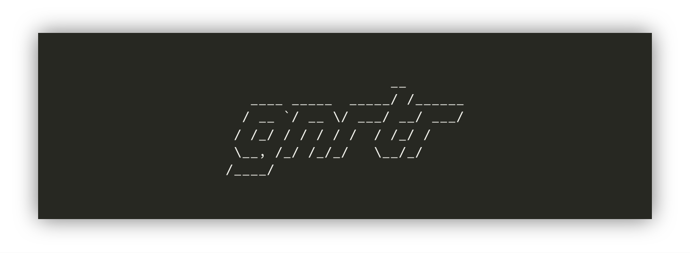

<h1 align="center">
  
   
  gnrtr
   
</h1>

  <em> Express · React</em>

<h4 align="center">A node starter app boilerplate generator</h4>

  
  
  

### Installation
1. Make sure you have node along with `npm` and `git` installed.
2. Install using `npm install -g gnrtr`.
3. Generate starter files by running `gnrtr`.

### Available Starter Projects
1. [express-app](https://github.com/rrsilaya/gnrtr/tree/master/templates/express-app)
2. [react-app](https://github.com/rrsilaya/gnrtr/tree/master/templates/react-app)
